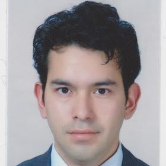

```{r, include=FALSE}
knitr::opts_chunk$set(
  results='asis', 
  echo = FALSE
)

library(magrittr) # For the pipe
source("cv_printing_functions.r")

# Read in all data and initialize a CV printer object
CV <- create_CV_object(
  data_location = "https://docs.google.com/spreadsheets/d/1Vh0QIRlqvu2-ErckYQm29GraMPh64iaunWYLi5p7J0c/edit#gid=917338460",  
  pdf_mode = params$pdf_mode
)

```


```{r}
# When in pdf export mode the little dots are unaligned, so fix that with some conditional CSS.
if(params$pdf_mode) {
    cat("
<style>
:root{
  --decorator-outer-offset-left: -6.5px;
}
</style>")
}
```


Aside
================================================================================

{width=100%}

```{r eval=FALSE}
# Build interactive network of positions colored by section
# and connected if they occurred in the same year
datadrivencv::build_network_logo(CV$entries_data)
```


```{r}
if(params$pdf_mode){
  cat("View this CV online with links at https://dravila-sl.github.io/cv/cv.html")
} else {
  cat("[<i class='fas fa-download'></i> Download a PDF of this CV](https://github.com/dravila-sl/dravila-sl.github.io/raw/main/cv/cv.pdf)")
}
```

Contact {#contact}
--------------------------------------------------------------------------------

```{r}
CV %>% print_contact_info()
```


Language Skills {#skills}
--------------------------------------------------------------------------------

```{r}
CV %>% print_skill_bars()
```


Main
================================================================================

Sergio L. Avila Calero {#title}
--------------------------------------------------------------------------------

```{r}
# Note the special double pipe so we modify the CV object in place
CV %<>% print_text_block("intro") 
```


Education {data-icon=graduation-cap data-concise=true}
--------------------------------------------------------------------------------

```{r}
CV %<>% print_section('education')
```


Research Experience {data-icon=laptop}
--------------------------------------------------------------------------------

```{r}
CV %<>% print_section('research_positions')
```

Courses and Seminars {data-icon=pencil}
--------------------------------------------------------------------------------

```{r}
CV %<>% print_section('courses_seminars')
```


<!-- These breaks just force a new page so section doesnt get cut off -->
<br>
<br>
<br>

Teaching Experience {data-icon=chalkboard-teacher}
--------------------------------------------------------------------------------

::: aside
```{r eval=FALSE}
CV %<>% print_text_block('teaching_experience_aside')
```
:::

```{r}
CV %<>% print_section('teaching_positions')
```


List of Publications {data-icon=book}
--------------------------------------------------------------------------------

```{r}
CV %<>% print_section('academic_articles')
```


::: aside
CV made with RStudio and [**pagedown**](https://github.com/rstudio/pagedown).

_Last updated on `r Sys.Date()`._
:::

```{r}
CV %<>% print_links()
```

